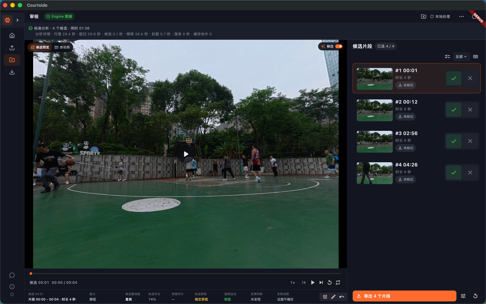
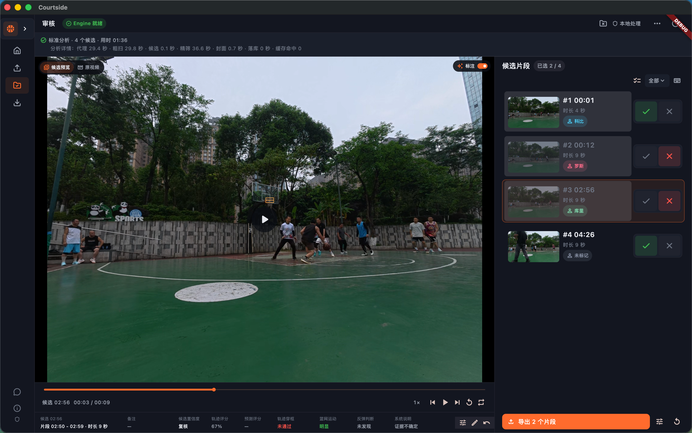
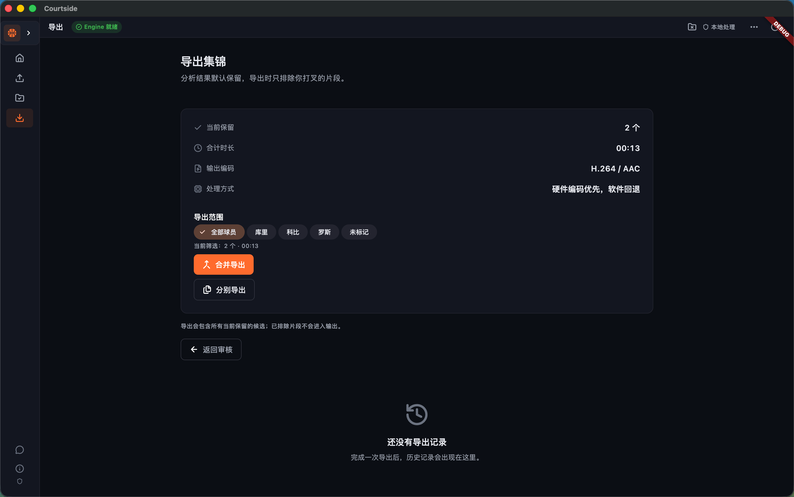

# Basketball Highlight Editor

> 打完球，最不想做的事，往往是回家后再花几个小时剪视频。
>
> Basketball Highlight Editor 会先帮你把整场比赛里可能的进球片段找出来，你只需要快速看一遍、删掉误检，再导出自己的集锦。

**完全本地运行 · 免费使用 · 自动找片段 · 人工可控**

[开始使用](#开始使用) · [功能介绍](#它能帮你省下什么) · [文档](#文档)

## 先说它解决什么问题

如果你拍过整场篮球比赛，应该遇到过这些情况：

- 比赛打了几十分钟，真正想留的进球可能只有十几个；
- 回家后需要反复拖进度条，找球、看回放、记时间点；
- 剪一个视频不难，但剪完整场很磨人，眼睛和耐心都消耗在来回找片段上；
- 全自动剪辑看起来省事，实际经常把误检也剪进去，最后还是得重新检查；
- 比赛视频通常比较大，不想为了剪一场球上传到云端，更不想被订阅和按分钟收费绑住。

这个项目的做法比较直接：**让机器负责找，让你负责决定。**

## 它能帮你省下什么

### 省时间

不用从头到尾盯着进度条找进球。Engine 会扫描视频，先给出一批疑似进球候选。你从“找素材”变成“看候选”，通常会轻松很多。

### 省力气

候选片段默认保留。大多数时候，你只需要排除误检，必要时调整片段前后几秒，不用每个候选都点一次确认。

### 不用上传视频

分析、预览、审核和导出默认在自己的电脑上完成。不需要账号，也不依赖在线接口；比赛视频可以留在本地。

### 不花订阅费

项目提供免费、本地部署的使用方式，不按视频时长或导出次数收费。需要准备的是自己的电脑、运行环境和有权使用的模型/素材。

### 结果仍然由你把关

它不是“按一下就替你决定一切”的黑盒。候选可以保留、排除、改时间、加备注、标记球员，也可以手动补上漏掉的片段。最后导出的内容由你决定。

## 功能介绍

- **自动扫描疑似进球**：针对固定机位、单篮筐比赛视频生成候选片段；
- **自动建议检测区域**：失败时可以手动框选和调整 ROI（感兴趣区域）；
- **快速模式 / 标准模式**：想先快速看结果就用快速模式，重要比赛可以用标准模式做更完整分析；
- **候选审核工作台**：视频区域优先，边播放边切换候选；
- **候选默认保留**：只需要排除误检，不用逐条确认；
- **时间范围调整**：把进球前后的铺垫和落地过程留得更合适；
- **手动补漏**：自动检测没找到的片段，可以从原视频当前时间直接加入；
- **按标签整理集锦**：标签不只可以标记球员，也可以标记三分、扣篮、犯规、精彩防守等场景；标签名称由你自己定义，支持批量标记和按标签导出；
- **两种导出方式**：合并成一条集锦，或为每个候选分别导出；
- **导出后打开目录**：不用再手动翻文件夹找成片；
- **任务进度和耗时记录**：知道现在处理到哪一步，也方便比较快速/标准模式的速度。

## 实际使用流程

```text
导入比赛视频
    ↓
设置分析范围和篮筐区域
    ↓
选择快速模式或标准模式
    ↓
等待自动分析
    ↓
在审核工作台快速过一遍候选
    ↓
排除误检、调整时间、补漏
    ↓
合并导出或分别导出
```

候选是“疑似事件”，不是模型盖章的最终答案。固定机位、篮筐清晰、画面稳定时，通常更适合当前版本；机位变化很大、篮筐被遮挡或一段视频里有多个篮筐时，建议认真审核结果。

### 一场比赛里有多人，怎么分别导出？

这也是这个工具比较适合球队和训练赛的地方。分析完成后，你可以在审核工作台给每个进球选择球员：

1. 先创建球员名称，例如“张三”“李四”；
2. 在候选片段上标记对应球员，也可以批量给多个候选设置同一个标签；
3. 进入导出页，选择某一位球员，只导出他的进球集锦；
4. 需要团队集锦时，可以选择多位球员，或直接导出全部保留的候选。

被排除的误检不会进入任何人的集锦。没有标记球员的片段也不会被悄悄丢掉，导出时可以选择是否把“未分配球员”的候选一起带上。

## 界面预览

审核时，视频区域会尽量保持足够大，候选列表放在旁边，方便连续查看：



排除的候选不会被删除，之后仍然可以恢复或复核：



审核完成后，可以按标签筛选片段，再合并成一条集锦，或者分别导出每个片段：



### 标签不只用来标记球员

一场比赛里有多人时，可以给进球标记对应球员；想整理不同类型的片段，也可以自己创建标签，例如：

- 球员：`张三`、`李四`；
- 得分：`三分`、`扣篮`、`上篮`；
- 比赛场景：`犯规`、`精彩防守`、`关键回合`。

同一个片段可以有多个标签。导出时可以只选某位球员、某种场景，或同时选择多个标签，分别制作个人集锦、三分集锦、扣篮集锦和整场集锦。

更多页面、按钮、快捷键和白色主题截图见 [`docs/USER_FLOW_V1.md`](docs/USER_FLOW_V1.md) 以及 [`docs/README.md`](docs/README.md)。

## 开始使用

当前仓库提供源码部署方式，macOS 是最完整的体验路径，Windows 已提供兼容路径。暂时没有把它包装成“下载后双击就能用”的安装包，所以第一次需要准备本地开发环境。

### macOS

需要 Python 3.11、Flutter stable 和 FFmpeg/FFprobe：

```bash
brew install ffmpeg

git clone https://github.com/fly7632785/basketball-highlight-editor.git
cd basketball-highlight-editor

python3.11 -m venv .venv
.venv/bin/python -m pip install --upgrade pip
.venv/bin/python -m pip install -r requirements-dev.txt

.venv/bin/python scripts/check_runtime.py \
  --root . \
  --python .venv/bin/python

cd apps/desktop
flutter pub get
flutter run -d macos
```

启动后按“新建项目 → 选择视频 → 分析 → 审核 → 导出”操作即可。

### Windows

Windows 可以使用一键搭建脚本：

```powershell
git clone https://github.com/fly7632785/basketball-highlight-editor.git
cd basketball-highlight-editor
powershell -ExecutionPolicy Bypass -File scripts\setup_windows.ps1
```

也可以按手动方式安装 Python、Flutter Windows 工具链和 FFmpeg，具体命令见 [`docs/MACOS_PACKAGING_V1.md`](docs/MACOS_PACKAGING_V1.md)。当前 Windows 全流程已经过本地验证，但仍属于持续完善中的平台路径。

### 模型和视频

完整源码包含默认模型：

```text
models/bball_model.pt
models/bball_model.onnx
```

正常 clone 后不需要再从陌生地址下载模型。模型、比赛视频、训练数据和第三方依赖仍然要遵守各自的授权条件；不要把没有公开处理权的素材提交到仓库。

## 快速模式和标准模式

| 模式 | 适合什么时候用 | 取舍 |
|---|---|---|
| **快速模式** | 想先快速看一版候选，或者只是找几个大概时间点 | 等得更短，但可能漏掉部分事件 |
| **标准模式** | 重要比赛、希望尽量完整地找候选 | 分析更慢，但会做更完整的筛选 |

两种模式的审核和导出方式一样。快速模式只是帮你更快得到第一版结果，不会替你做最终选择。

## 技术上怎么工作的

- **Flutter**：桌面端界面和审核工作台；
- **Python + OpenCV + YOLO**：视频采样、篮球/篮筐检测和候选生成；
- **SQLite**：保存项目、任务、候选和审核状态；
- **FFmpeg / FFprobe**：读取视频信息、生成预览和导出片段；
- **Rust + ONNX Runtime**：移动端本地推理路径。

技术细节、Engine 协议、数据库结构和移动端边界见 [`docs/README.md`](docs/README.md) 和 [`docs/architecture/`](docs/architecture/)。

## 当前范围

目前最适合：

- 固定机位；
- 单场比赛；
- 单个篮筐；
- 需要快速整理校队、业余联赛或训练赛集锦的球员、教练和拍摄者。

暂时不把多机位、多篮筐、实时直播、云端协作和“完全无人审核”当作当前版本能力。项目会优先把本地分析、候选审核和导出这条主路径做好。

## 文档

- [用户流程](docs/USER_FLOW_V1.md)：从导入到导出的操作和异常路径；
- [产品需求](docs/REQUIREMENTS_V1.md)：当前 V1 范围、已实现能力和剩余工作；
- [决策记录](docs/DECISIONS_V1.md)：快速/标准模式、审核语义和工程边界；
- [架构说明](docs/architecture/ARCHITECTURE_V1.md)：模块职责和任务生命周期；
- [Engine 协议](docs/architecture/ENGINE_PROTOCOL_V1.md)：Flutter 与 Python Engine 的 JSONL 契约；
- [SQLite 结构](docs/architecture/SQLITE_SCHEMA_V1.sql)：项目数据库结构；
- [macOS 打包](docs/MACOS_PACKAGING_V1.md)：运行时、构建和分发边界；
- [审核数据导出](docs/REVIEW_DATASET_EXPORT.md)：导出人工审核数据的用法；
- [性能基准](docs/research/ANALYSIS_MODE_BENCHMARK_20260812.md)：快速/标准模式实测记录。

## 开源参考

项目在模型、检测流程和产品工作流上参考了 [HoopCut](https://github.com/RuiYang0122/HoopCut)、[basketball-highlights](https://github.com/reborncd/basketball-highlights)、[ShotMarker](https://github.com/zhangrunhao/ShotMarker)、[basketball_clipper](https://github.com/snowroll/basketball_clipper)、[ball-yolo](https://github.com/griftt/ball-yolo)、[ClarkWang1214/basketball-highlights](https://github.com/ClarkWang1214/basketball-highlights) 和 [ai-sports-cut-agent](https://github.com/bond0060/ai-sports-cut-agent)。感谢这些项目公开分享的思路和实践。

## 隐私和授权

视频默认只在本地处理，不上传到云端。源码、模型、训练数据、比赛画面和第三方依赖的授权范围并不相同，发布或分发前请查看 [`docs/research/LICENSE_NOTES.md`](docs/research/LICENSE_NOTES.md) 和 [`docs/research/THIRD_PARTY_MANIFEST.md`](docs/research/THIRD_PARTY_MANIFEST.md)。

如果你用它剪过一场比赛，欢迎反馈：哪些地方真的省时间，哪些误检最烦，哪些操作还不顺手。这个项目最需要的不是漂亮的宣传语，而是这些真实使用反馈。
