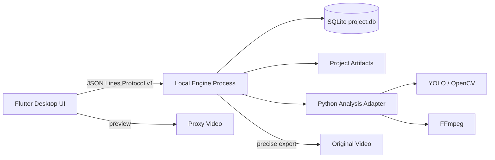

# 架构、协议与运行时

**中文** · [English](ARCHITECTURE.en.md)

这份文档是实现细节的统一入口，包含桌面架构、Engine JSONL 协议、移动端 Runtime 和项目目录规则。产品边界见 [`PRODUCT_SPEC.md`](PRODUCT_SPEC.md)，开发命令见 [`DEVELOPMENT.md`](DEVELOPMENT.md)。

## 1. 桌面架构（V1）

### 1. 目标与边界

V1 的目标是跑通一条可用的桌面闭环：

```text
导入视频 → 框选篮筐 → 生成代理 → 分析 → 审核候选 → 调整片段 → 导出
```

已确定边界：

- macOS 先行，Windows 紧随其后；
- 手机端后续复用业务模型，但采用独立移动审核界面；
- 本地处理，不登录、不云同步；
- 单项目单视频、单 ROI，底层预留多视频和多 ROI；
- 原始视频默认只引用，不复制、不移动；
- 代理视频用于审核，原始视频用于精确导出；
- 候选默认保留，只有用户明确排除的片段不进入导出；
- 同一时间只运行一个重型分析任务；
- 主题支持跟随系统、浅色、深色。

### 2. 总体结构



#### 2.1 Flutter UI（已完成 V1 桌面工作台）

职责：

- 项目和视频选择；
- 篮筐 ROI 配置；
- 任务启动、进度、取消和恢复；
- 候选片段播放与审核；
- 片段起止点调整；
- 单独导出和合并导出；
- 主题、语言、隐私和磁盘设置。

当前已落地：Material 3 主题、系统/浅色/深色切换、响应式导航、视频元数据、预览帧 ROI 标注、分析进度、候选审核、片段范围调整和单独/合并导出。视频处理与数据写入继续由 Engine 负责，UI 不直接操作 SQLite。

UI 不直接调用 YOLO、OpenCV、FFmpeg，也不直接修改 SQLite。项目状态由 Riverpod 管理，页面路由由 go_router 管理。

#### 2.2 Local Engine（协议基座已完成）

职责：

- 处理 JSON Lines 请求；
- 负责任务队列和状态持久化；
- 调用现有 Python 脚本；
- 管理代理、检测缓存、候选和导出产物；
- 写入 SQLite；
- 输出进度、日志、错误码和完成事件。

V1 的 Engine 使用 Python 实现。当前已完成 JSONL 服务、SQLite 初始化、项目、视频元数据、任务记录、审核状态、导出统计、任务恢复发现和现有分析脚本适配。后续 Rust 只替换 Engine 内部实现，协议和数据库契约保持不变。

#### 2.3 Storage

每个项目一个 SQLite 数据库：

```text
project.db = 唯一业务状态
artifacts/ = 可重建的中间产物
logs/      = 诊断日志
```

数据库负责事实状态，中间文件负责大文件和算法产物，不能把视频二进制塞进 SQLite。

### 3. 模块边界

```text
apps/desktop/                 Flutter UI
engine/python/                Engine 进程和协议适配
engine/python/adapters/       现有算法脚本适配层
engine/python/storage/        SQLite 仓储
docs/architecture/            架构和协议文档
```

依赖方向：

```text
Flutter UI → Protocol / Domain
Python Engine → Protocol / Domain / Storage / Adapters
Adapters → 现有算法脚本
```

禁止：

- UI 直接执行 `ffmpeg`；
- UI 直接读写检测 JSON；
- 算法脚本直接依赖 Flutter 状态；
- 导出脚本直接改变审核状态；
- 把临时文件路径当成业务 ID。

### 4. 任务生命周期

```text
queued → running → completed
             ├── cancelling → cancelled
             └── failed
```

任务阶段：

```text
validate_input
prepare_proxy
coarse_scan
refine_candidates
persist_candidates
review
export
cleanup
```

每个阶段都写入 `jobs.progress` 和 checkpoint。重新启动时从最后一个可恢复阶段继续。

### 5. UI 响应式策略

#### Desktop ≥ 1200px

```text
导航栏 240px | 视频工作区 flex | 候选列表 360px
底部固定时间轴与批量操作栏
```

#### Tablet 768–1199px

```text
顶部项目栏
视频区占主区域
候选列表改为可收起侧栏
```

#### Mobile < 768px

V1 不实现完整移动端，但保留独立布局契约：

```text
视频预览 → 候选卡片 → 左右滑动审核 → 导出状态
```

### 6. UI 设计系统

设计源文件：

`apps/desktop/lib/theme/app_theme.dart` 和 `apps/desktop/lib/theme/tokens.dart`

产品覆盖规则：

- 深色工作台是默认主题；
- 进球确认使用橙色强调色；
- `goal` 使用绿色；`pending` 使用橙色；`excluded` 使用灰色；错误使用红色；
- 所有交互控件保留键盘 focus 状态；
- 不使用 emoji 作为图标；
- 动效默认 150–300ms，并支持减少动效；
- 颜色不能作为唯一状态表达方式，必须同时有文字或图标。

### 7. 演进路线

```text
V1  Flutter + Python Engine + SQLite + FFmpeg
V1.5 Windows 打包 + Engine 独立安装包
V2   Python 算法核心迁移 Rust / ONNX Runtime
V2.5 iOS / Android 审核端
V3   可选匿名遥测和云端算法实验平台
```

Rust 和云端都不是 V1 的前置依赖。


---

## Engine JSON Lines Protocol V1

## 1. 传输方式

- Flutter 启动 Engine 子进程；
- Flutter 写入 Engine `stdin`；
- Engine 通过 `stdout` 输出 JSON Lines；
- `stderr` 只用于诊断，不作为业务协议；
- 每行必须是一个完整 UTF-8 JSON 对象；
- 请求和事件使用 `request_id` 关联。

## 2. 基础格式

请求：

```json
{
  "protocol_version": "1.0",
  "type": "request",
  "request_id": "req-123",
  "command": "start_analysis",
  "payload": {}
}
```

响应：

```json
{
  "protocol_version": "1.0",
  "type": "response",
  "request_id": "req-123",
  "ok": true,
  "payload": {}
}
```

事件：

```json
{
  "protocol_version": "1.0",
  "type": "event",
  "request_id": "req-123",
  "event": "progress",
  "job_id": "job-123",
  "payload": {
    "stage": "refine_candidates",
    "progress": 0.42,
    "message": "正在精筛候选片段"
  }
}
```

## 3. V1 命令

| 命令 | 用途 |
|---|---|
| `hello` | 协商协议、Engine 版本和能力 |
| `create_project` | 创建项目数据库和目录 |
| `update_project_settings` | 持久化项目名称和主题模式 |
| `open_project` | 打开已存在的项目目录并返回项目、视频、ROI、统计上下文 |
| `delete_project` | 删除项目数据库、分析缓存和导出文件，不删除项目外的原始视频 |
| `list_recent_projects` | 只在调用方显式提供的目录下扫描一级子目录，列出最近修改的项目 |
| `inspect_video` | 读取视频元数据和磁盘需求 |
| `link_video` | 引用原始视频 |
| `relink_video` | 原始视频被移动后，更新已有视频的引用路径并重新读取元数据 |
| `extract_preview` | 从原始视频提取 ROI 页面预览帧 |
| `save_roi` | 保存篮筐区域和校准数据 |
| `start_analysis` | 异步启动代理、粗扫、候选生成和精筛任务 |
| `get_job` | 查询任务状态 |
| `get_active_jobs` | 查询未完成的分析任务及恢复状态，不启动任务 |
| `get_latest_job` | 查询指定项目/视频最近一条分析或导出任务，用于重开项目恢复终态信息 |
| `retry_analysis` | 结束已中断的分析任务并从头重新开始，不覆盖原始视频 |
| `cancel_job` | 请求取消任务 |
| `list_candidates` | 按事件时间查询候选、保留/排除语义和审核用代理视频路径 |
| `create_manual_candidate` | 从原视频当前时间段创建手动候选，默认保留并可导出 |
| `delete_player` | 删除项目球员，并将已关联候选置为未标记 |
| `start_review` | 记录开始审核某个候选的时间 |
| `review_candidate` | 写入确认 / 排除 / 暂缓状态、原因和备注，并结算审核耗时 |
| `list_review_history` | 查询候选的审核操作历史 |
| `update_clip_range` | 修改片段起止时间 |
| `start_export` | 异步导出所有未排除的候选，返回可由 `get_job` 查询的任务 |
| `retry_export` | 使用上次导出参数重新启动失败或取消的导出任务 |
| `list_exports` | 查询项目最近的导出记录和耗时统计 |
| `cleanup_artifacts` | 清理可重建中间文件 |
| `get_statistics` | 查询项目和导出统计 |
| `set_telemetry_consent` | 保存用户授权状态 |

## 4. 事件类型

```text
job_started
progress
candidate_created
artifact_created
log
job_completed
job_cancelled
job_failed
```

## 5. 错误码

```text
INVALID_REQUEST
UNSUPPORTED_PROTOCOL
PROJECT_NOT_FOUND
PROJECT_INVALID
VIDEO_NOT_FOUND
VIDEO_OPEN_FAILED
VIDEO_FORMAT_UNSUPPORTED
ROI_INVALID
DISK_SPACE_LOW
MODEL_LOAD_FAILED
ANALYSIS_FAILED
EXPORT_FAILED
JOB_NOT_FOUND
JOB_ALREADY_RUNNING
JOB_CANCELLED
```

### `get_active_jobs`

请求 payload：

```json
{
  "project_root": "/path/to/project",
  "video_id": "video_xxx",
  "job_type": "analysis"
}
```

`video_id` 可选；省略时返回该项目全部 `analysis` 类型且状态为 `queued` 或 `running` 的任务。

成功响应 payload：

```json
{
  "count": 1,
  "jobs": [
    {
      "id": "job_xxx",
      "type": "analysis",
      "state": "running",
      "stage": "coarse_scan",
      "progress": 0.42,
      "checkpoint_json": "{\"frame\":123}",
      "checkpoint": {
        "frame": 123
      },
      "runtime_state": "stale",
      "recovery_state": "stale_recoverable",
      "recoverable": true
    }
  ]
}
```

字段语义：

- `checkpoint` 是 `checkpoint_json` 的解析结果；`progress` 为最近一次持久化进度，范围为 `0.0` 到 `1.0`。
- `runtime_state=running` 且 `recovery_state=worker_attached` 表示当前 Engine 进程仍持有该任务线程，不能再次启动。
- `state=queued` 且 `recovery_state=queued_recoverable` 表示任务已入库但尚未绑定运行线程，可进入后续恢复流程。
- `state=running` 但 `runtime_state=stale` 且 `recovery_state=stale_recoverable` 表示数据库记录显示曾运行，但当前 Engine 进程没有对应线程，通常是 Engine 进程退出或崩溃造成；接口不会把它伪装成仍在运行，也不会自动启动新任务。
- `recoverable` 只表示该记录可以进入后续恢复流程，不代表本命令已经恢复或重跑任务。
- `job_type` 默认是 `analysis`，也可传 `export` 查询未完成导出任务。

限制：V1 只提供发现和状态标记，不提供断点续跑或 `recover_job`。当前 checkpoint 是阶段级元数据，不保证算法脚本能从任意帧继续；恢复实现必须先检查已有代理、检测和候选产物，避免重复写入或覆盖人工审核结果。跨多个 Engine 进程操作同一项目仍不受支持。

`retry_analysis` 是“从头重跑”而非断点续跑：仅接受当前 Engine 未持有线程的 `queued/running` 任务，先将旧任务标记为 `cancelled`，再创建新的分析任务。它不会删除原始视频、项目数据库或用户明确保留的导出文件；候选重建仍应在审核前执行。

## 6. 兼容规则

- 新字段默认可选；
- 不删除已发布字段；
- 新命令通过 `capabilities` 协商；
- Engine 不认识的命令必须返回 `INVALID_REQUEST`；
- Flutter 不认识的事件必须记录日志并忽略，不得崩溃；
- 协议测试使用固定 JSON fixtures。

### `open_project`

请求 payload：

```json
{
  "project_root": "/path/to/project"
}
```

成功响应 payload：

```json
{
  "database_path": "/path/to/project/project.db",
  "project_root": "/path/to/project",
  "project": {},
  "video": {},
  "roi": {},
  "statistics": {}
}
```

该命令只打开包含有效 `project.db` 和项目记录的目录，不会为不存在或无效的目录创建数据库或目录。

### `delete_project`

请求 payload：

```json
{
  "project_root": "/path/to/project"
}
```

成功响应 payload：

```json
{
  "deleted": true,
  "project_root": "/path/to/project",
  "project_id": "project-123"
}
```

该命令只允许删除包含有效 `project.db` 的项目目录；如果项目仍有任务进程运行，返回 `PROJECT_BUSY`，调用方应先取消任务。原始视频通常位于项目目录之外，不会被删除。

### `list_candidates`

成功响应除 `candidates` 外，可返回最近一次完整分析生成且仍存在的审核代理视频：

```json
{
  "candidates": [],
  "review_video_path": "/path/to/project/artifacts/proxies/video_key.mp4"
}
```

`review_video_path` 仅用于审核播放；原始视频路径仍由 `videos.source_path` 保存并只用于精确导出。代理不存在时该字段为 `null`，调用方应回退到原始视频或提示重新生成分析。

每个候选都返回 `selection_status`：`included` 表示默认保留，`excluded` 表示用户已打叉剔除。手动候选的 `detector_version` 为 `manual-v1`，`confidence` 为 `manual`，证据中的 `source` 为 `manual`。
旧版 `review_status` 仍保留用于兼容历史项目；导出以 `selection_status` 为准，未排除候选都会进入输出。

审核接口约定：调用方进入候选时可发送 `start_review`，payload 为
`{ "project_root": "...", "candidate_id": "...", "review_started_at": "<ISO-8601 可选>" }`。
提交时发送 `review_candidate`，除 `candidate_id`、`status` 外可带 `reason`、`note` 和
`review_started_at`；Engine 会把 `review_started_at`、`reviewed_at` 和非负的
`review_duration_ms` 写入候选审核记录。旧客户端不调用 `start_review` 时，提交动作仍然有效，
审核耗时按 0 记录。`list_review_history` 返回每次审核动作及其状态、原因、备注、时间和耗时。

`delete_player` 请求 payload 为 `{ "project_root": "...", "player_id": "player-1" }`。删除使用项目范围校验；数据库的 `ON DELETE SET NULL` 会把已关联候选安全地恢复为未标记。

`create_manual_candidate` 请求 payload 为 `{ "project_root": "...", "video_id": "...", "start_ms": 12000, "end_ms": 21000, "event_time_ms": 16000 }`。`event_time_ms` 可省略，省略时取片段中点；手动候选直接写入当前候选列表，默认保留。重新分析时会保留手动候选，不被新批次替换。

`get_statistics` 的 `statistics` 对象包含候选数、待审核数、已审核数、确认数、排除数、
`confirmation_rate`、`avg_review_duration_ms`、`reason_distribution` 和
`conflict_count`；统计字段缺失时客户端应按 0 或空集合降级。

`inspect_video` 还返回 `available_disk_bytes`、`estimated_processing_space_bytes` 和 `disk_space_sufficient`，用于导入页提前提示长视频处理所需空间。分析和导出启动前会再次按项目工作目录执行预检，失败返回 `DISK_SPACE_LOW`。

`open_project` 和 `list_recent_projects` 返回的视频对象还包含 `source_exists` 和 `source_status`。当原始视频被移动后，调用方应显示重新定位入口；`relink_video` 只更新视频引用和重新读取的媒体元数据，不删除候选、审核记录或项目数据库。

### `list_recent_projects`

请求 payload：

```json
{
  "roots": ["/path/to/known/projects"],
  "limit": 20
}
```

成功响应 payload：

```json
{
  "projects": [],
  "scanned_roots": ["/path/to/known/projects"]
}
```

安全边界：`roots` 必须由调用方显式提供；Engine 只检查每个 root 自身及其一级子目录中的 `project.db`，不递归扫描用户目录，也不跟随一级子目录中的符号链接。结果按项目数据库最近修改时间倒序排列。

当前已可运行的最小闭环命令：`hello`、`create_project`、`update_project_settings`、`open_project`、`delete_project`、`list_recent_projects`、`inspect_video`、`link_video`、`relink_video`、`extract_preview`、`save_roi`、`start_analysis`、`retry_analysis`、`cancel_job`、`get_job`、`get_active_jobs`、`get_latest_job`、`list_candidates`、`create_manual_candidate`、`delete_player`、`start_review`、`review_candidate`、`list_review_history`、`update_clip_range`、`start_export`、`retry_export`、`get_statistics`、`set_telemetry_consent`、`cleanup_artifacts`。


---

## Mobile Runtime

## 当前边界

`apps/mobile` 是独立的 Flutter 应用，不启动桌面 Python Engine，也不依赖桌面项目。Flutter 层负责项目状态、项目包、视频播放、ROI 编辑和审核流程；平台层负责媒体操作，原生 Runtime 负责移动端推理。

当前状态：

- Flutter UI、项目持久化、项目包导入/导出和分析进度恢复路径已实现；
- Android 已实现视频抽帧、进度回传、取消、片段导出，以及 Rust/ONNX JNI seam；当前主要验证 `arm64-v8a`；
- Android 原生 `.so` 和 ONNX Runtime 是构建输入，不应把未核验的开发产物当作公开发布附件；
- iOS 的项目、播放、审核和导出 channel 已接入；本地分析仍需要 Rust 静态库、ONNX Runtime XCFramework 和 Runner 链接；
- 缺少原生库时统一返回 `NATIVE_RUNTIME_UNAVAILABLE`，不会用空候选掩盖 Runtime 缺失。

## 原生边界

- `MobileAnalysisEngine`：抽象移动端推理和候选生成；
- `NativeAnalysisEngine`：Flutter 与平台分析 channel 的桥接；
- `MobileExportEngine`：移动端视频片段导出；
- `com.bhe.bhe/mobile_media`：视频导出、保存到媒体库等平台媒体操作；
- `com.bhe.bhe/mobile_analysis`：启动/取消分析；
- `com.bhe.bhe/mobile_analysis_progress`：分析进度事件；
- `packages/bhe_runtime/include/bhe_runtime.h`：Rust C ABI 边界。

平台实现必须显式报告参数错误、Runtime 缺失、模型加载失败、取消和导出失败。不要返回空数组来伪装分析成功。

## 模型与输入

桌面模型转换为移动 ONNX 的入口：

```bash
.venv/bin/python scripts/export_mobile_model.py \
  --model models/bball_model.pt \
  --output models/bball_model.onnx
```

转换产物需要分别验证：

- 桌面模型与 ONNX 数值/候选一致性；
- Android/iOS ONNX Runtime 加载；
- Rust 输入的图像尺寸、归一化、类别映射和输出格式；
- 真机长视频的内存、温度、耗时和取消行为。

模型权利独立于源码许可证，见 [`RELEASE.md#模型与数据授权`](RELEASE.md#模型与数据授权)。

## Android 构建

当前支持的本地入口目标为 `arm64-v8a`：

```bash
export BHE_ANDROID_NDK="$HOME/Library/Android/sdk/ndk/<version>"
export BHE_ORT_ANDROID_DIR="/path/to/onnxruntime-android"
rustup target add aarch64-linux-android
scripts/build_mobile_runtime.sh
cd apps/mobile
flutter build apk --release
```

`BHE_ORT_ANDROID_DIR` 必须包含：

```text
arm64-v8a/libonnxruntime.so
```

脚本会检查 Rust、Android NDK、Rust target 和 ONNX Runtime 文件；缺少任一项时失败，而不是生成看似支持分析、实际不能推理的 APK。增加其他 ABI 前，先验证对应 ONNX Runtime 二进制和设备性能。

## iOS 构建

Rust 静态库和 C ABI 头文件生成入口：

```bash
export BHE_ORT_IOS_XCFRAMEWORK="/path/to/onnxruntime.xcframework"
scripts/build_mobile_ios_runtime.sh
```

脚本要求 `aarch64-apple-ios`、`aarch64-apple-ios-sim` targets 和 ONNX Runtime XCFramework，生成 device/simulator 静态库与头文件。它不会自动把产物写入 Xcode 工程，也不会在缺少依赖时生成不完整产物。

完成真正 iOS 分析发布前还要：

1. 将静态库、头文件和 XCFramework 接入 Runner；
2. 验证 Debug/Release 的 linker search path 和 framework flags；
3. 在真机和模拟器分别验证模型加载、帧抽取、取消和导出；
4. 核对静态链接和发布物的许可证 notices。

## 媒体和项目包行为

- iOS 使用 `AVAssetExportSession` 导出 MP4 片段；
- Android 使用 `MediaExtractor` 和 `MediaMuxer` 复制音视频轨道；
- 项目包保存项目设置、视频元数据、ROI、候选、审核状态和标签，不复制原始视频；
- 重新打开项目时必须重新关联原视频；
- 重新关联会校验时长、尺寸和由文件头/尾/大小计算的快速 SHA-256 指纹，避免完整读取多 GB 视频；
- 保存到媒体库需要用户授权，失败必须向 UI 返回明确错误。


---

## 项目目录与生命周期

## 1. 仓库目录

```text
basketball-highlight-editor/
├── apps/
│   └── desktop/                    Flutter macOS 工程（已创建，Windows 后续启用）
├── engine/
│   └── python/
│       ├── basketball_engine/      Engine 进程
│       └── README.md
├── src/                            当前算法库（如存在）
├── scripts/                        当前算法脚本
├── data/                           本地研发数据，不进入正式项目目录
└── docs/
    └── architecture/
```

## 2. 用户项目目录

```text
<project-root>/
├── project.db
├── artifacts/
│   ├── proxies/
│   ├── detections/
│   ├── review_clips/
│   └── exports/
├── logs/
├── telemetry_outbox/                默认为空，授权后才使用
└── README.txt
```

原始视频默认保留在原位置，数据库保存：

- 绝对路径；
- 文件大小；
- 修改时间；
- SHA-256 可选校验值；
- 视频时长、分辨率、帧率、编码。

如果原始文件移动，UI 显示“重新定位视频”，不自动猜测新路径。

## 3. 缓存清理规则

可删除：

- 代理视频；
- 检测缓存；
- 已导出的临时片段；
- 失败任务的临时目录。

不可自动删除：

- 原始视频；
- SQLite 数据库；
- 用户审核记录；
- 用户明确保留的导出文件。

