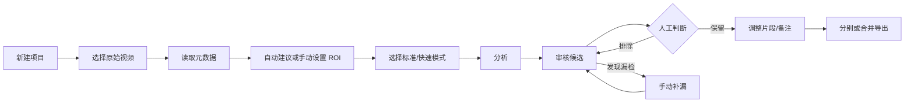

# 产品规格与 V1 决策

这份文档合并了产品范围、用户流程和当前决策。它描述的是代码需要遵守的边界，不是愿望清单。运行时行为和测试与旧记录冲突时，以运行时为准。

## 1. 产品定位和范围

Basketball Highlight Editor 面向固定机位、单篮筐、单场比赛视频。工具在本地生成高召回的疑似进球候选，用户审核后再导出集锦。

| 项目 | V1 定义 |
|---|---|
| 桌面端 | macOS 主路径；Windows 有兼容脚本，不作为正式发布门槛 |
| 移动端 | 独立 Flutter App；Android 已有原生分析实验路径，iOS 本地分析等待 Runtime 链接 |
| 处理方式 | 默认本地处理，不登录、不上传原视频 |
| 输入 | 单项目、单视频、单篮筐、固定机位 |
| 输出 | 未排除的候选片段，可调整、补漏、分别导出或合并导出 |
| 默认片段 | 事件前 6 秒、事件后 3 秒，审核时可以修改 |

模型负责缩小回看范围，不负责替用户判定“这一定是进球”。

## 2. 用户流程



1. Engine 用 `ffprobe` 读取时长、分辨率、帧率、编码和音频信息。
2. 用户接受自动 ROI（感兴趣区域）建议，或手动调整篮筐和篮网区域。
3. 标准模式先粗扫，再对候选回源精筛；快速模式使用低成本代理并跳过精筛。
4. 审核工作台播放原视频或审核代理，支持保留/排除、时间范围、备注、球员标签和手动候选。
5. 候选默认保留，只有被排除的候选不进入导出。
6. 导出前重新读取数据库中的审核状态；合并导出按事件时间排序并处理重叠。

## 3. 当前实现状态

### 桌面端

- [x] 新建项目、导入视频、读取元数据和重新定位源文件。
- [x] 自动建议 ROI，失败时手动设置；标准/快速分析。
- [x] 进度、阶段耗时、取消、失败提示、重试和中断任务发现。
- [x] 候选播放、切换、保留/排除、备注、球员标签、时间调整和手动补漏。
- [x] 分别导出、合并导出、导出进度、取消、重试和导出历史。
- [x] 重型任务启动前检查磁盘空间；新批次成功前保留旧候选。

### 移动端

- [x] 独立 Flutter 工程、项目持久化、视频导入/播放和项目包导入导出。
- [x] Android 抽帧、取消、进度、Rust/ONNX channel 和视频导出，主要验证 `arm64-v8a`。
- [x] 移动端审核、备注、球员标签、导出和保存到媒体库入口。
- [x] 缺少原生 Runtime 时返回 `NATIVE_RUNTIME_UNAVAILABLE`。
- [ ] iOS Rust 静态库、ONNX Runtime XCFramework 与 Runner 的完整链接。
- [ ] Android/iOS 真机模型一致性、长视频性能和导出兼容性验收。

## 4. 状态、数据和任务约束

- 桌面每个项目使用一个 `project.db`；中间产物放在 `artifacts/`，日志放在 `logs/`。
- 项目保存源路径、文件大小、修改时间、媒体元数据和可选快速 SHA-256；不复制或自动删除原视频。
- ROI 保存归一化坐标和来源，区分自动建议与手动编辑。
- 候选保存事件时间、片段范围、选择状态、备注、球员标签、审核时间和证据字段。
- 手动候选的 `detector_version` 为 `manual-v1`，重新分析时不得静默删除。
- 任务状态为 `queued / running / completed / failed / cancelled`，并保存错误码和阶段信息。
- 同一项目一次只运行一个重型分析或导出任务。取消、失败和重试不能清除已有审核记录。
- 分析批次成功前不能替换当前候选；导出期间锁定影响本次导出的审核写入。

## 5. 产品决策

| 领域 | 决策 |
|---|---|
| 桌面引擎 | Python 独立进程，通过 JSONL（逐行 JSON）与 Flutter 通信；先稳定协议和数据契约，再考虑替换内部实现 |
| 移动推理 | Rust + ONNX Runtime，通过平台 channel/FFI 接入，不依赖桌面 Python |
| 视频处理 | 桌面由 FFmpeg 负责代理、预览和精确导出；移动端使用平台媒体 API |
| 审核语义 | 候选默认保留，用户排除误检；漏检从原视频当前位置手动加入 |
| 隐私 | 默认本地处理、不登录、不上传；任何遥测必须先取得明确授权 |
| 模式记忆 | 新项目默认标准，按项目记忆上次选择；分析开始后锁定 |
| 结果批次 | 每次重新分析创建新批次，成功后切换；失败或取消保留旧结果 |
| 性能记录 | 保存阶段耗时、缓存命中、设备和实际参数，便于比较优化前后差异 |
| 快速入口 | 桌面默认可见；设置 `ENABLE_FAST_ANALYSIS=false` 可在发布构建中隐藏 |

## 6. 已吸收的开源思路

参考过 HoopCut、basketball-highlights、ShotMarker、basketball_clipper、ball-yolo、ClarkWang1214/basketball-highlights 和 ai-sports-cut-agent。借鉴的是公开项目里对 ROI、跳帧、缓存、粗扫/精筛、轨迹信号、片段合并和审核流程的思路；本项目重新实现代码，不直接复制代码、权重或数据。

## 7. 当前不在 V1 范围内

云端同步、账号系统、在线模型服务、多视频、多篮筐、多机位、实时直播、桌面 Engine 整体 Rust 化、Windows 正式安装器和 iOS 本地分析正式发布，都不是源码预览版的前置条件。

## 8. 验收和变更规则

最小验收路径：

```text
新建 → 导入 → 元数据 → ROI → 标准分析 → 审核
→ 调整片段 → 分别/合并导出 → 重启恢复
```

同时检查源视频重新定位、空候选排查、分析取消/重试和导出失败/重试。修改以下内容时，必须同步更新本规格、协议/SQLite 契约和测试：

- Flutter 与 Engine 协议；
- SQLite 或移动项目包数据模型；
- 未审核候选是否可导出；
- 原视频复制、移动或上传策略；
- Python/Rust/ONNX 推理和模型分发方式；
- 快速/标准模式的候选来源、缓存键或继承规则。

性能实验应记录视频时长、分辨率、编码、ROI、模式、代理规格、FPS、模型版本、各阶段耗时、缓存命中、候选数和人工真值。单个样本不能代表跨视频准确率；实验记录保留在 [`benchmarks/ANALYSIS_MODE_BENCHMARK_20260812.md`](benchmarks/ANALYSIS_MODE_BENCHMARK_20260812.md)。
