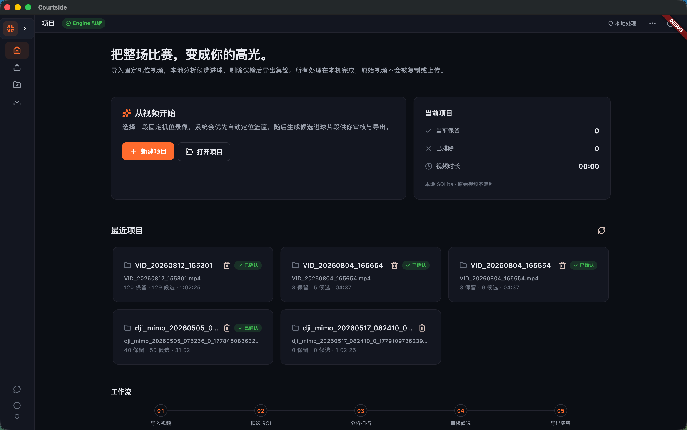
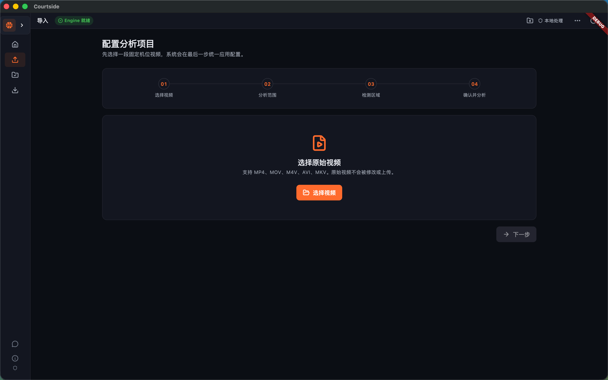
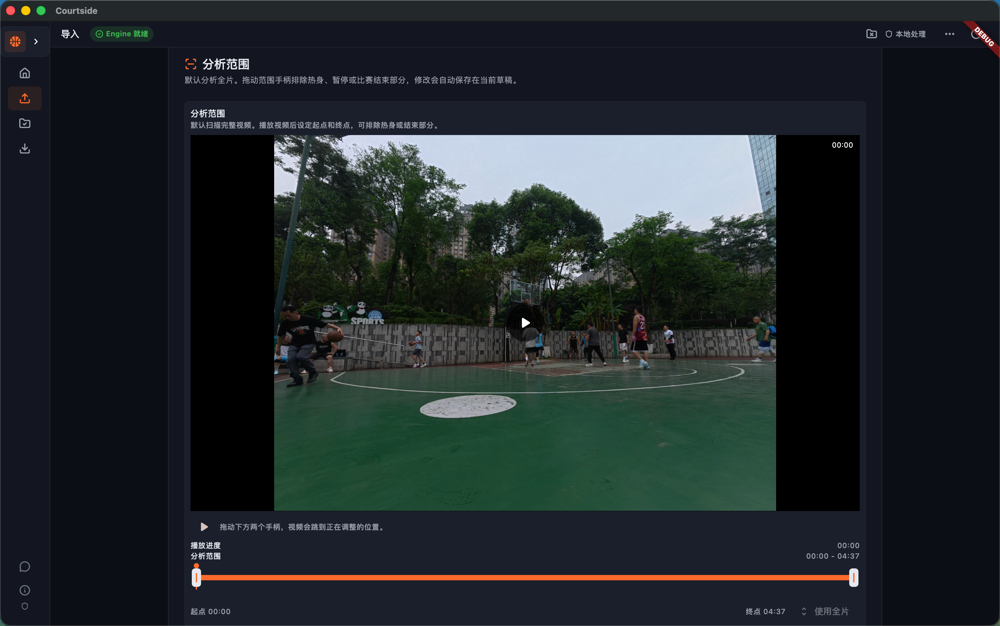
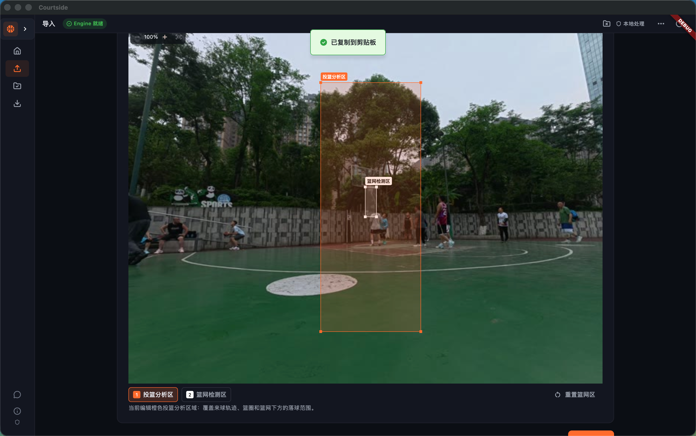
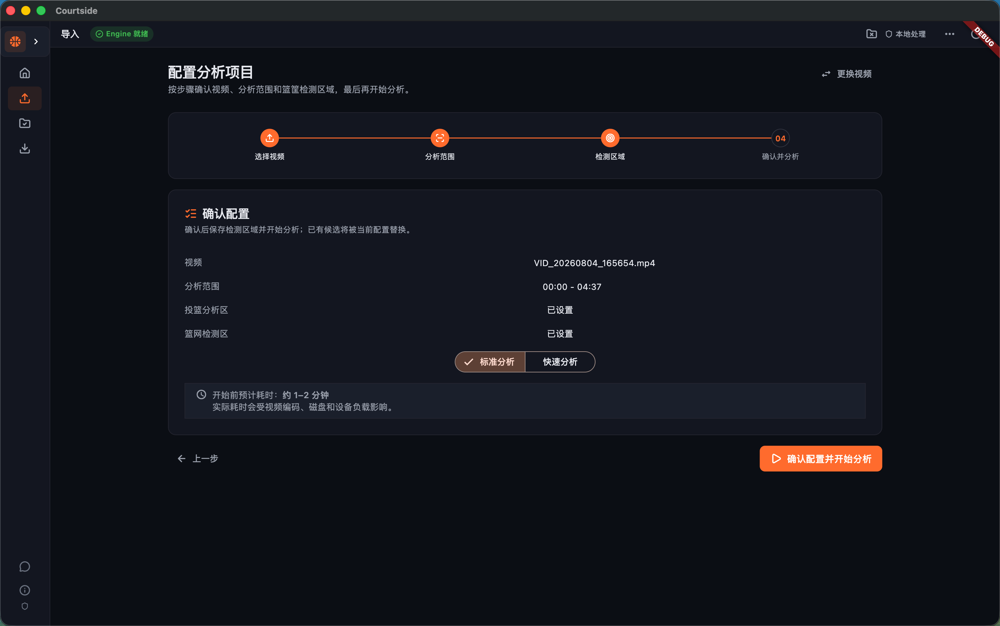
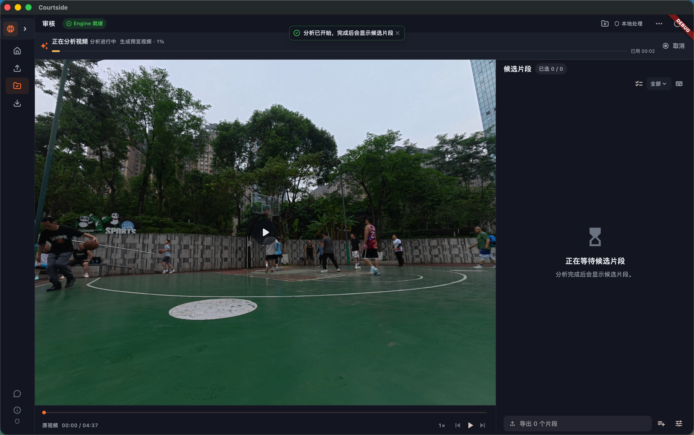
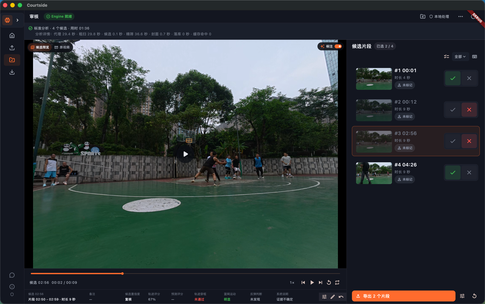
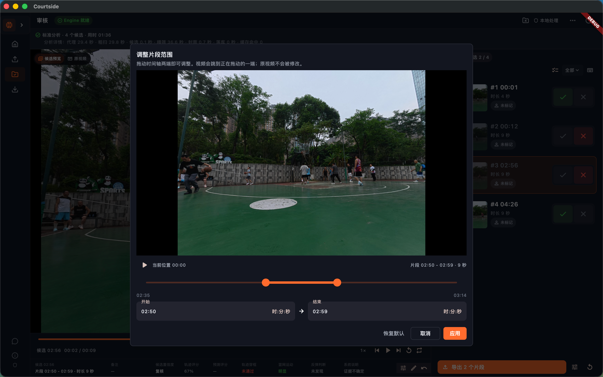
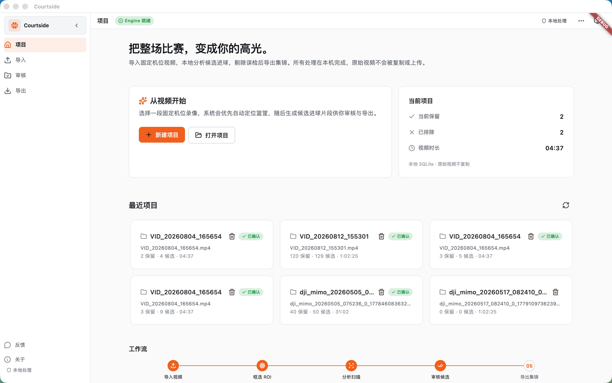
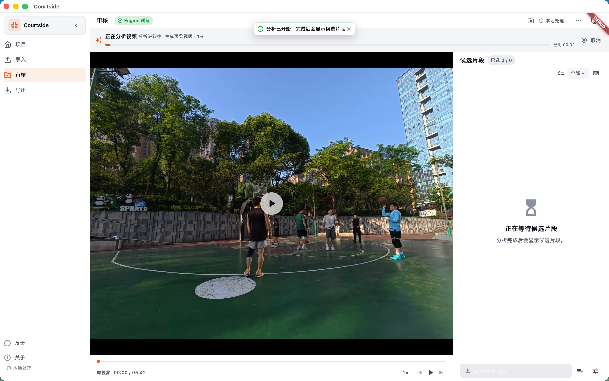

# 产品界面与操作导览

**中文** · [English](SCREENSHOTS.en.md)

这份文档按真实使用顺序介绍桌面端的主要页面、按钮和交互。展示顺序统一以**深色主题**为主，方便在 GitHub 页面中保持一致；页面功能不因主题变化而改变。

## 一、完整操作路径

```text
项目首页 → 新建项目 → 导入视频 → 设置分析范围 → 设置检测区域
→ 选择标准/快速模式 → 开始分析 → 审核候选 → 调整和标记
→ 补漏（可选）→ 合并或分别导出
```

| 阶段 | 页面 | 主要操作 |
|---|---|---|
| 1 | 项目首页 | 新建项目、打开项目、查看最近项目和当前统计 |
| 2 | 导入视频 | 选择视频、读取元数据、替换视频 |
| 3 | 分析范围 | 播放预览、拖动起止点、使用全片、返回上一步 |
| 4 | 检测区域 | 接受自动建议、手动调整投篮分析区和篮网检测区 |
| 5 | 确认分析 | 选择标准/快速模式、查看预计耗时、返回修改、开始分析 |
| 6 | 分析进度 | 查看阶段和进度、查看耗时、取消任务、等待候选生成 |
| 7 | 审核工作台 | 播放、切换候选、保留/排除、筛选、标记球员、编辑片段 |
| 8 | 导出集锦 | 按球员筛选、合并导出、分别导出、返回审核、打开导出目录 |

## 二、按页面查看

### 1. 项目首页：从一个项目开始



- 点击**新建项目**进入导入流程，点击**打开项目**恢复已有项目。
- **当前项目**显示保留数、排除数和视频时长。
- **最近项目**可以直接打开已有项目，也可以删除不需要的项目。
- 底部工作流提示当前处于“导入视频 → 框选 ROI → 分析扫描 → 审核候选 → 导出集锦”的哪一步。

### 2. 导入视频：只引用本地原视频



- 点击**选择视频**选择 MP4、MOV、M4V、AVI 或 MKV 等视频。
- 原视频默认只保存本地引用，不会被复制或上传。
- 视频加载后会读取时长、分辨率、帧率和编码信息。
- 如果原视频被移动，可以通过**重新定位视频**重新选择文件；不会静默猜测路径。

### 3. 设置分析范围：只分析需要的部分



- 播放视频并观察需要分析的区间。
- 拖动时间轴两端的手柄设置**起点**和**终点**。
- 点击**使用全片**恢复整段视频范围。
- 可以返回上一步重新选择视频，也可以点击**下一步**进入检测区域设置。
- 缩短范围通常可以减少分析耗时，但可能漏掉范围外的事件。

### 4. 设置检测区域：自动优先，手动可改



- 系统会先尝试自动建议篮筐区域。
- **投篮分析区**用于覆盖投篮轨迹、篮筐和篮下落点附近的范围。
- **篮网检测区**用于观察篮网运动，建议不要包含过多球员、地面或背景。
- 点击区域标签，在视频画面中拖动边框和控制点进行调整。
- 点击**重置篮网区**恢复系统建议；自动识别失败时可以完全手动设置。

### 5. 确认分析：选择模式后开始



- 确认视频、分析范围、投篮分析区和篮网检测区。
- **标准分析**：质量优先，会对候选回到原视频进行精筛。
- **快速分析**：速度优先，适合快速浏览，可能漏检。
- 页面会显示预计耗时，实际耗时会受视频编码、磁盘和设备性能影响。
- 点击**上一步**修改设置，点击**确认配置并开始分析**进入审核工作台。
- 分析开始后模式会锁定；需要切换模式时先取消当前任务，再重新分析。

### 6. 分析进度：任务可观察、可取消



- 顶部显示当前阶段、进度和已用时间。
- 分析阶段可能包括代理生成、快速扫描、候选生成、精细分析和候选封面准备。
- 点击右上角**取消**可以停止当前任务。
- 分析完成后，候选片段会自动出现在审核工作台；旧候选不会在新结果成功前被替换。
- 如果结果为空，优先检查模型、检测区域、分析范围和视频格式，再决定是否重新配置或改用标准分析。

### 7. 审核工作台：视频优先，候选默认保留


- 左侧视频区域用于播放和定位，右侧是候选列表；候选按事件时间排序。
- 点击候选卡片可以切换候选，但**切换不会改变审核结果**。
- 点击绿色**勾选**保留候选，点击**叉号**排除误检；候选默认保留，不需要逐条确认。
- 顶部可以在**候选预览**和**原视频**之间切换，也可以打开/关闭标注层。
- 播放栏支持播放、暂停、拖动进度、快退/快进、倍速、重播和循环播放。
- 底部证据区域展示置信度、轨迹评分、篮网运动、反弹判断和系统说明，帮助用户做最终判断。



- 被排除的候选会保留在列表中，方便恢复或复核。
- 再次点击勾选可以恢复导出资格；导出时只有被排除的候选不会进入结果。
- 顶部筛选支持全部、待审核、已确认、已排除和低置信度候选。

### 8. 调整片段范围：只修改导出窗口



- 点击候选底部的**调整片段范围**打开编辑窗口。
- 拖动时间轴两端调整开始和结束时间，也可以直接填写时间。
- 点击**恢复默认**回到系统生成的片段窗口。
- 点击**取消**放弃修改，点击**应用**保存当前范围。
- 该操作不会修改原视频，只决定这个候选最终导出的时间范围。

### 9. 标记球员：便于筛选和导出


- 在候选卡片中打开球员选择器，为候选添加球员标签。
- 可以选择已有球员，也可以点击**新建球员**创建标签。
- 支持批量选择候选并批量设置球员标签。
- 导出页面可以按球员筛选，不会改变候选的保留/排除状态。

### 10. 手动补漏、备注和撤销

以下操作属于审核工作台的辅助操作，当前截图没有单独拆出弹窗，但功能完整保留：

- **手动补漏**：切换到原视频，在事件发生位置暂停，点击“从原视频当前时间补漏候选”，设置片段范围后点击**加入候选**。
- **备注**：点击候选的备注入口，记录动作、球员或需要复核的原因。
- **撤销审核**：点击撤销按钮，或使用 `Cmd/Ctrl+Z` 撤销上一次审核操作。
- **快捷键**：`Space` 播放/暂停，`R` 重播，`L` 循环，`A` 切换标注，`↑/↓` 切换候选，`←/→` 快退/快进 2 秒，`C/Enter` 保留，`X/Backspace` 排除。

### 11. 导出集锦：合并或分别导出


- 页面默认统计当前保留候选的数量和总时长。
- 可以按**全部球员**或具体球员筛选导出范围。
- 点击**合并导出**生成一条按事件时间排序的集锦。
- 点击**分别导出**为每个候选生成独立视频片段。
- 已排除候选不会进入导出；返回审核后仍可以继续修改。
- 导出完成后会显示输出路径、片段数、时长、耗时、文件大小和编码信息，并提供**打开目录**入口。

## 三、主题说明

项目默认推荐使用**深色主题**，本页截图也以深色主题作为主要展示版本。深色主题和白色主题共享完全相同的页面、文案和操作，用户可以在应用设置或右上角菜单中切换。

白色主题仅作为补充展示：





## 四、截图使用说明

截图只用于界面说明。截图中的比赛视频和球员画面属于演示素材，公开发布前请确认拍摄者、球员、球队、场馆和画面的使用权；不应把真实路径、未脱敏数据或未授权素材提交到公开仓库。
