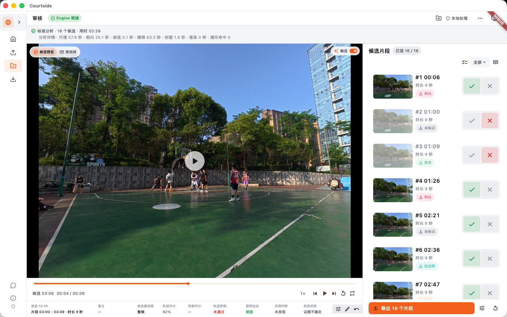
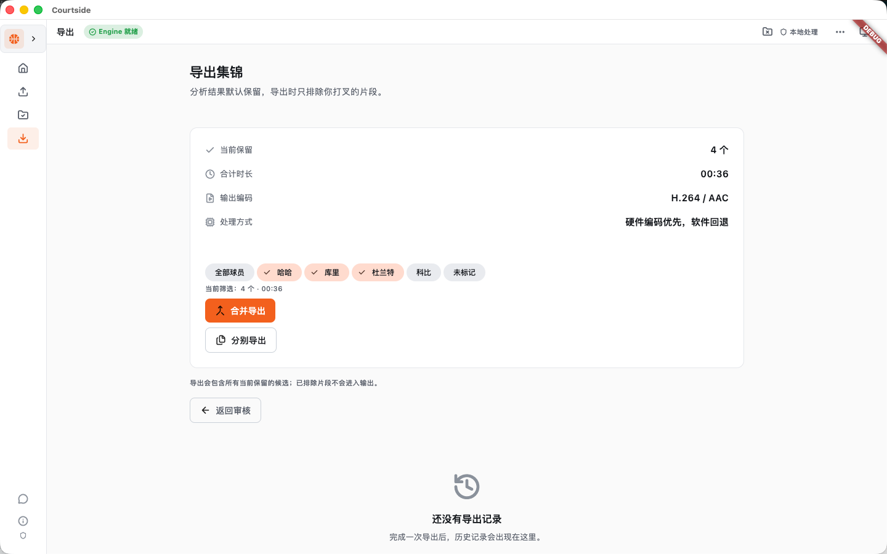

# 产品界面截图

这里集中展示主要页面，帮助第一次接触项目的人快速了解使用流程。截图来自本地演示视频，页面文案和布局可能会随版本调整。

## 1. 项目首页

从项目首页开始：新建或打开项目，之后按“导入视频 → 框选 ROI → 分析 → 审核 → 导出”的顺序操作。

## 2. 导入视频

选择原始比赛视频。原视频只作为本地输入引用，不会被复制或上传。

## 3. 设置分析范围

可以先限定整段视频的分析范围，再继续后面的篮筐区域设置和分析。

## 4. 审核候选片段

审核工作台同时显示原视频、候选列表和片段信息。用户可以播放、切换候选、保留、排除或调整时间范围。

## 5. 导出集锦

审核完成后，可以按当前保留结果合并导出，也可以分别导出每个片段。

> 截图只用于界面说明。真实比赛视频、球员画面和导出素材请确认拥有相应的使用权，不要把个人路径或未授权素材提交到公开仓库。
