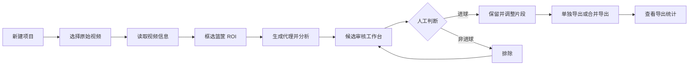

# 用户流程 V1

## 主流程

## 具体交互

1. 用户创建项目，选择一个视频文件；原始视频只保存引用路径。
2. Engine 用 `ffprobe` 读取时长、分辨率、帧率、编码和音频信息。
3. 用户在视频首帧或指定帧上框选篮筐区域，确认后保存 ROI。
4. 用户启动分析。UI 显示阶段、百分比、当前耗时和取消按钮。
5. Engine 先生成低清代理进行粗扫，再对候选窗口精筛；中间结果可重建并缓存。
6. UI 打开审核工作台：中间是视频预览，右侧是候选列表，底部是时间轴。
7. 用户可以使用鼠标或快捷键：
   - `Space`：播放/暂停；
   - `← / →`：切换候选；
   - `Enter`：确认进球；
   - `Backspace`：排除候选；
   - `Cmd/Ctrl+Z`：撤销上一次审核。
8. 用户可拖动片段开始和结束时间，默认窗口是前 6 秒、后 3 秒。
9. 只有状态为 `goal` 的候选可以导出。支持单独导出和按时间排序合并导出。
10. 导出完成后展示片段数量、总时长、耗时、文件大小、视频/音频编码和输出路径。

## 异常路径

- 原始视频被移动：显示“重新定位视频”，不自动猜测新路径。
- 磁盘空间不足：在分析/导出前提示所需空间和可清理的缓存。
- 分析被取消：保留已完成阶段和 checkpoint，下次可恢复。
- Engine 崩溃：UI 显示错误码和日志路径，项目状态不丢失。
- 算法结果为空：允许用户返回 ROI 页面重新框选，而不是直接判定视频没有进球。

## V1 约束

- 一次只处理一个重型任务。
- 候选是“疑似进球”，不是自动事实。
- 不在 UI 层暴露 YOLO、OpenCV、FFmpeg 的内部参数。
- 不上传原始视频；未来遥测必须经过授权弹框。

