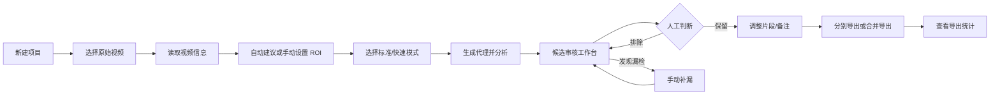

# 用户流程 V1

## 桌面主流程

## 具体交互

1. 用户创建项目并选择一个视频；原始视频只保存引用路径。
2. Engine 用 `ffprobe` 读取时长、分辨率、帧率、编码和音频信息。
3. 用户接受自动 ROI 建议，或在预览帧上手动框选/调整篮筐和篮网区域。
4. 用户选择标准或快速模式并启动分析；UI 显示阶段、进度、耗时和取消入口。
5. Engine 生成代理、粗扫并生成候选；标准模式随后对候选窗口回源精筛。
6. 分析成功后打开审核工作台，使用原视频播放，不把代理作为最终剪辑源。
7. 用户可以播放、暂停、拖动进度、切换候选、保留/排除、修改片段起止点、备注和标签。
8. 候选默认保留，只有被排除的候选不会进入导出；不要求逐条点击确认。
9. 如果发现漏检，用户从当前播放位置执行手动补漏，设置范围后加入候选。
10. 导出前重新读取数据库审核状态；支持分别导出和按事件时间合并导出。
11. 导出完成后展示片段数量、总时长、耗时、文件大小、编码和输出路径。

## 异常路径

- **原视频被移动：** 显示缺失状态和“重新定位视频”，不自动猜测新路径。
- **磁盘空间不足：** 在分析/导出前阻止重型任务，提示所需空间和可清理缓存。
- **分析被取消：** 保留旧候选和已完成缓存；下次打开时识别中断任务并提供重试。
- **Engine 崩溃：** 显示错误码和日志路径，项目状态不丢失；任务标记为可恢复而不是伪装成运行中。
- **分析结果为空：** 提示检查模型、ROI、范围和视频格式，可返回 ROI 页面重新设置。
- **快速模式漏检风险：** 不自动切换为标准结果；用户可以显式用标准模式重新分析。
- **移动端缺少原生库：** 返回 `NATIVE_RUNTIME_UNAVAILABLE`，保留 UI/导出能力但不伪造候选。

## 约束

- 一次只处理一个重型分析或导出任务。
- 分析批次成功前不能替换当前候选。
- 候选是疑似事件，不是自动事实。
- 不在 UI 层暴露 YOLO、OpenCV、FFmpeg 的内部参数。
- 默认不上传原始视频；未来遥测必须先获得明确授权。
