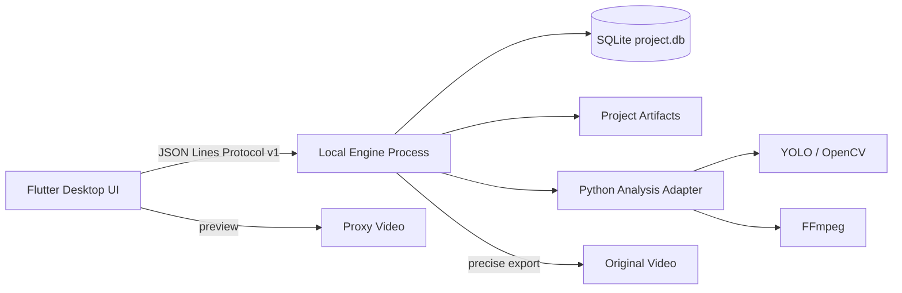

# Basketball Highlight Editor：V1 架构设计

## 1. 目标与边界

V1 的目标是跑通一条可用的桌面闭环：

```text
导入视频 → 框选篮筐 → 生成代理 → 分析 → 审核候选 → 调整片段 → 导出
```

已确定边界：

- macOS 先行，Windows 紧随其后；
- 手机端后续复用业务模型，但采用独立移动审核界面；
- 本地处理，不登录、不云同步；
- 单项目单视频、单 ROI，底层预留多视频和多 ROI；
- 原始视频默认只引用，不复制、不移动；
- 代理视频用于审核，原始视频用于精确导出；
- 候选默认保留，只有用户明确排除的片段不进入导出；
- 同一时间只运行一个重型分析任务；
- 主题支持跟随系统、浅色、深色。

## 2. 总体结构



### 2.1 Flutter UI（已完成 V1 桌面工作台）

职责：

- 项目和视频选择；
- 篮筐 ROI 配置；
- 任务启动、进度、取消和恢复；
- 候选片段播放与审核；
- 片段起止点调整；
- 单独导出和合并导出；
- 主题、语言、隐私和磁盘设置。

当前已落地：Material 3 主题、系统/浅色/深色切换、响应式导航、视频元数据、预览帧 ROI 标注、分析进度、候选审核、片段范围调整和单独/合并导出。视频处理与数据写入继续由 Engine 负责，UI 不直接操作 SQLite。

UI 不直接调用 YOLO、OpenCV、FFmpeg，也不直接修改 SQLite。项目状态由 Riverpod 管理，页面路由由 go_router 管理。

### 2.2 Local Engine（协议基座已完成）

职责：

- 处理 JSON Lines 请求；
- 负责任务队列和状态持久化；
- 调用现有 Python 脚本；
- 管理代理、检测缓存、候选和导出产物；
- 写入 SQLite；
- 输出进度、日志、错误码和完成事件。

V1 的 Engine 使用 Python 实现。当前已完成 JSONL 服务、SQLite 初始化、项目、视频元数据、任务记录、审核状态、导出统计、任务恢复发现和现有分析脚本适配。后续 Rust 只替换 Engine 内部实现，协议和数据库契约保持不变。

### 2.3 Storage

每个项目一个 SQLite 数据库：

```text
project.db = 唯一业务状态
artifacts/ = 可重建的中间产物
logs/      = 诊断日志
```

数据库负责事实状态，中间文件负责大文件和算法产物，不能把视频二进制塞进 SQLite。

## 3. 模块边界

```text
apps/desktop/                 Flutter UI
engine/python/                Engine 进程和协议适配
engine/python/adapters/       现有算法脚本适配层
engine/python/storage/        SQLite 仓储
docs/architecture/            架构和协议文档
```

依赖方向：

```text
Flutter UI → Protocol / Domain
Python Engine → Protocol / Domain / Storage / Adapters
Adapters → 现有算法脚本
```

禁止：

- UI 直接执行 `ffmpeg`；
- UI 直接读写检测 JSON；
- 算法脚本直接依赖 Flutter 状态；
- 导出脚本直接改变审核状态；
- 把临时文件路径当成业务 ID。

## 4. 任务生命周期

```text
queued → running → completed
             ├── cancelling → cancelled
             └── failed
```

任务阶段：

```text
validate_input
prepare_proxy
coarse_scan
refine_candidates
persist_candidates
review
export
cleanup
```

每个阶段都写入 `jobs.progress` 和 checkpoint。重新启动时从最后一个可恢复阶段继续。

## 5. UI 响应式策略

### Desktop ≥ 1200px

```text
导航栏 240px | 视频工作区 flex | 候选列表 360px
底部固定时间轴与批量操作栏
```

### Tablet 768–1199px

```text
顶部项目栏
视频区占主区域
候选列表改为可收起侧栏
```

### Mobile < 768px

V1 不实现完整移动端，但保留独立布局契约：

```text
视频预览 → 候选卡片 → 左右滑动审核 → 导出状态
```

## 6. UI 设计系统

设计源文件：

`apps/desktop/lib/theme/app_theme.dart` 和 `apps/desktop/lib/theme/tokens.dart`

产品覆盖规则：

- 深色工作台是默认主题；
- 进球确认使用橙色强调色；
- `goal` 使用绿色；`pending` 使用橙色；`excluded` 使用灰色；错误使用红色；
- 所有交互控件保留键盘 focus 状态；
- 不使用 emoji 作为图标；
- 动效默认 150–300ms，并支持减少动效；
- 颜色不能作为唯一状态表达方式，必须同时有文字或图标。

## 7. 演进路线

```text
V1  Flutter + Python Engine + SQLite + FFmpeg
V1.5 Windows 打包 + Engine 独立安装包
V2   Python 算法核心迁移 Rust / ONNX Runtime
V2.5 iOS / Android 审核端
V3   可选匿名遥测和云端算法实验平台
```

Rust 和云端都不是 V1 的前置依赖。
